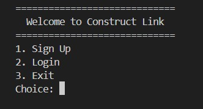

# **ConstructLink – C++ Construction Job Portal**

A simple **C++ console-based application** that helps connect construction industry professionals—**Architects, Contractors, Engineers, and Clients**.  
Users can **sign up, log in, post jobs, search jobs**, and interact with a minimal job-portal style system.

---

## 🚀 Features

### 👤 User Management
- Sign Up with name, contact, and role  
- Login using user index  
- Simple data handling using vectors

### 🧱 Job Portal
- Post new jobs  
- Search available jobs  
- View job details  
- Jobs stored and managed using vectors

### 🛠️ Tech Stack
- **Language:** C++  
- **Concepts Used:**  
  - OOP (Classes, Objects)  
  - Vectors  
  - Basic input/output operations

---

## 📂 Project Structure

```
/ConstructLink
│── main.cpp
│── User class
│── Job class
│── images/
│    └── terminal-demo.png
│── README.md
```

---

## 📝 How to Run the Project

1. Install a C++ compiler (GCC, MinGW, or clang).
2. Clone the repository:
   ```bash
   git clone https://github.com/<your-username>/<repo-name>.git
   ```
3. Open the folder:
   ```bash
   cd <repo-name>
   ```
4. Compile the project:
   ```bash
   g++ main.cpp -o constructlink
   ```
5. Run the program:
   ```bash
   ./constructlink
   ```

---

## 📸 Terminal Preview

Here is an example output of the ConstructLink system running in the terminal:

<p align="center">
  
</p>
<br>
<p align="center">
  
</p>

---

## 🔧 Future Improvements

- Add file storage for saving users/jobs permanently  
- Add password authentication  
- Add edit/update/delete job features  
- Use classes with better encapsulation  
- Add color and formatting for better UI  
- Convert to GUI or web-based app in the future  

---

## 📌 About This Project

This project was created for learning and demonstration purposes.  
It showcases basic construction industry workflows in a simple console application using C++.

